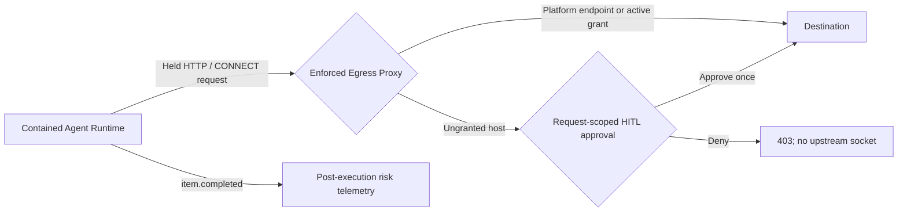
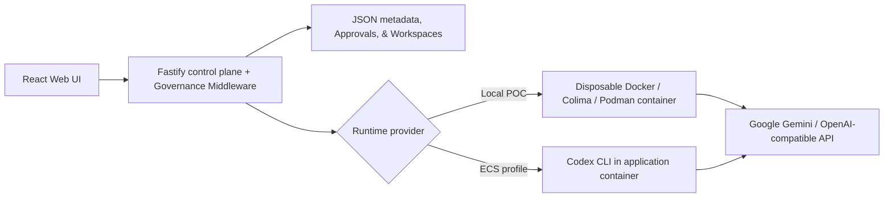

# Agent Passport

**Your coding agent just tried to send your credentials to an unknown server. Watch it fail.**

AI coding agents read untrusted content and then run commands. Prompt injection is unsolved, so the honest assumption is that any agent can be turned against you. Agent Passport does not try to make the model trustworthy — it makes the platform safe *while the model is hostile*.

An agent here runs with **no route off the box**. Its only path to the network is a proxy that checks every single connection against grants you issue and can revoke at any moment.

```
1. Agent tries to reach example.com with NO grant   ->  403  blocked
2. Operator issues a network:egress grant           ->  200  allowed
3. Operator REVOKES the grant mid-flight            ->  403  revocation bites instantly
4. Agent keeps probing for a way out                ->  quarantined, status: stopped
5. Agent tries to skip the proxy entirely           ->  no route: the network itself refuses
```

That is real output from `npm run demo` — real containers, a real network, a real blocked exfiltration. Nothing is stubbed.

## What this adds to the starter kit

The Agent Launchpad starter kit already provided agent CRUD, the Playground, the Codex container runtime, human-in-the-loop approvals, a canary tripwire, budget breakers, and the trace timeline. **This project adds the parts that were missing:**

- **Agent identity.** A human principal and an agent principal are different things. Every agent is owned by a user and acts as its own principal.
- **Scoped, expiring, revocable grants.** An agent may read *this* resource, or reach *this* host, for *this* long. Decisions are re-checked on every single access — nothing is cached, so revocation is felt on the very next call rather than at token expiry.
- **Enforced network containment.** Not pattern-matching on command text after the fact: the agent container has no route off-box, and a proxy authorizes every connection. A blocked host is unreachable, not merely disapproved.
- **Containment escalation.** Repeated blocked attempts — the signature of a hijacked agent hunting for an exfil route — quarantine the agent automatically.
- **A receipt for everything.** Every allow and every deny lands on the run timeline with a rule ID explaining itself.

Full detail, including what is *not* solved: **[docs/AGENT-PASSPORT.md](docs/AGENT-PASSPORT.md)**.

## Try the containment demo first

```bash
npm install
npm run demo
```

Needs a container engine (Docker/OrbStack, Colima, or Podman). No API key required — it stages the attack against a real proxy on a real isolated network.

For the full platform with a live agent, add a key and run `npm run poc`; egress enforcement is **on by default**, and the Passport panel in the UI shows grants, live expiry countdowns, and one-click revocation.

## Screenshots

### Agent Playground & Human-in-the-Loop Gate


### Create an Agent


## Inherited vs. added

Being precise about provenance: the approval UI, canary tripwire, budget breakers, and trace timeline came with the starter kit. This project adds identity, grants, authorization evaluators, and a network approval gate enforced before an outbound connection is opened.

## Requirements

- Node.js 22+
- npm 10+
- Docker, Colima, or Podman
- A model API key — any one of:
  - **BytePlus ModelArk** (`ARK_API_KEY` plus an `ep-` endpoint ID) — the starter kit's own provider, and the path to use if you were issued an Ark key
  - **Google Gemini** (from Google AI Studio), reached through the internal Responses adapter
  - Any **OpenAI-compatible** endpoint, such as OpenRouter

Codex CLI is included in the Runtime image and is not required on the host.

### On Windows

`npm run poc` is a bash script and needs **WSL2** — which Docker Desktop for
Windows already requires, so the environment is usually there. Inside a WSL2
shell everything below works unchanged.

Natively on Windows, use the [Docker Compose](#docker-compose) path with
`npm run bootstrap`. That gives you the full platform, but note it runs
`RUNTIME_PROVIDER=local-process`, and egress enforcement exists only under the
container runtime — so the containment demo needs WSL2.

## Local browser SOP

### 1. Check the local tools

Install Node.js 22+ and one supported container engine, then verify them:

```bash
node --version
npm --version
docker --version        # Docker Desktop, Docker Engine, or Colima
podman --version        # Use this instead when running Podman
```

Only one container engine is required. Codex CLI is already included in the
Runtime image.

### 2. Clone the repository

```bash
git clone <repository-url> volc-agent-launchpad
cd volc-agent-launchpad
```

Skip this step when already working from the repository root.

### 3. Start the POC

Configure your API key in `.env` (copied from `.env.example`):

```bash
# Option A: With Gemini in .env (Recommended)
HOST=127.0.0.1 npm run poc

# Option B: Pass via CLI environment variable
HOST=127.0.0.1 GEMINI_API_KEY=your-gemini-api-key npm run poc

# Option C: BytePlus ModelArk, the starter kit's own provider
HOST=127.0.0.1 ARK_API_KEY=your-ark-api-key ARK_MODEL=ep-your-endpoint-id npm run poc
```

`ARK_API_KEY` must be an Ark *model* API key rather than an account AK/SK, and
`ARK_MODEL` is the endpoint ID beginning with `ep-`; the wrong credential
returns 401 from the Ark Responses API. Set `MODEL_PROVIDER` explicitly when
`.env` holds credentials for more than one provider.

The first run installs Node.js dependencies and builds the Runtime image. The
script automatically selects Docker, Colima, or Podman.

### 4. Open the browser

Visit <http://localhost:3000>, or open it from the terminal:

```bash
open http://localhost:3000       # macOS
xdg-open http://localhost:3000   # Linux desktop
```

In the Web UI:

1. Select **Create Agent**.
2. Enter a name, description, and workspace instructions.
3. Select **Create Agent** again.
4. Enter a task in the Playground, for example:

   ```text
   Create a TypeScript hello-world CLI, add a test, and run it.
   ```

The Agent can write files, run commands, and continue the same Codex session in
later messages.

### 5. Stop and resume

Press `Ctrl+C` in the startup terminal. The script removes temporary Runtime
containers but keeps Agent workspaces and conversations.

- macOS state: `~/.volc-agent-launchpad/`
- Linux state: `.local/`
- Custom location: set `LOCAL_POC_DATA_ROOT`

Run the same `npm run poc` command to continue later.

### Select a specific container engine

Force Podman when multiple engines are installed:

```bash
HOST=127.0.0.1 CONTAINER_ENGINE=podman GEMINI_API_KEY=your-gemini-api-key npm run poc
```

Colima uses `CONTAINER_ENGINE=docker` because it exposes the Docker CLI.

For a clean Linux host, follow the
[rootless Podman setup](docs/LOCAL_POC.md#rootless-podman-on-linux).

## Docker Compose

Create and edit the configuration:

```bash
npm run bootstrap
```

Compose runs the server with `NODE_ENV=production` and `HOST=0.0.0.0`, so it
refuses to start without a real `APP_AUTH_TOKEN`. This command creates `.env`
from the example, generates that token, and makes the state directories. It is
idempotent and runs on every platform, Windows included.

Compose runs the server in production mode, where the process binds `0.0.0.0`
inside its container. Only the published port decides who can reach it, so
Compose publishes on `127.0.0.1` by default and the bootstrap command creates a
URL-safe `APP_AUTH_TOKEN` when `.env` does not already contain a valid one. To
serve the demo to another machine, set `PUBLIC_BIND=0.0.0.0`; that token is then
the only thing standing between the internet and your Agents. To rotate it later, replace that value in `.env` with the output of:

```bash
node -e 'console.log(require("node:crypto").randomBytes(24).toString("base64url"))'
```

Required provider values in `.env`:

```dotenv
# Option A: Google Gemini API (Recommended)
GEMINI_API_KEY=your-gemini-api-key
GEMINI_MODEL=gemini-3.5-flash-lite

# Option B: OpenRouter Fallback
# OPENROUTER_API_KEY=your-openrouter-api-key
# OPENROUTER_MODEL=openai/gpt-4o-mini
```

Start the application:

```bash
docker compose up --build
```

Open <http://localhost:3000>. Stop it without deleting Agent data:

```bash
docker compose down
```

## Development

```bash
npm install
cp .env.example .env
npm install --global @openai/codex@0.111.0
npm run dev
```

- Web UI: <http://localhost:5173>
- API: <http://localhost:3000>

Use local paths in `.env` when running outside Docker:

```dotenv
APP_DATA_DIR=.data
AGENT_WORKSPACE_ROOT=workspaces
CODEX_HOME=codex-home
```

## Deployment

- [Existing Linux ECS with Docker](docs/DEPLOYMENT.md#existing-linux-ecs)
- [Complete Volcengine environment with Terraform](docs/DEPLOYMENT.md#terraform-deployment)
- [Local Docker, Colima, and Podman details](docs/LOCAL_POC.md)

The existing-ECS script deploys from the current source tree:

```bash
cp .env.example .env.production
./scripts/deploy-existing-ecs.sh .env.production
```

The Terraform path provisions VPC, subnet, security group, ECS, and EIP:

```bash
cp deploy/volcengine/terraform.tfvars.example \
  deploy/volcengine/terraform.tfvars
./scripts/deploy-volcengine.sh
```

## Configuration

| Variable | Default | Purpose |
| --- | --- | --- |
| `MODEL_PROVIDER` | Auto-detected for one configured provider | Explicitly select `gemini`, `openrouter`, or `ark`; required when multiple providers are present. |
| `GEMINI_API_KEY` | Optional | Google Gemini API key used only through the internal adapter. |
| `GEMINI_MODEL` | `gemini-3.5-flash-lite` | Gemini model variant (e.g. `gemini-3.5-flash-lite`, `gemini-2.5-flash`). |
| `OPENROUTER_API_KEY` | Optional | OpenRouter API key, used only when OpenRouter is selected. |
| `OPENROUTER_MODEL` | Optional | OpenRouter model slug (e.g. `openai/gpt-4o-mini`). |
| `OPENROUTER_BASE_URL` | `https://openrouter.ai/api/v1` | OpenRouter API base URL. |
| `ARK_API_KEY` | Optional | BytePlus ModelArk API key, used only when Ark is selected. |
| `ARK_MODEL` | Optional | ModelArk endpoint ID (for example, `ep-your-endpoint-id`). |
| `ARK_BASE_URL` | `https://ark.cn-beijing.volces.com/api/v3` | ModelArk Responses API base URL. |
| `RUNTIME_PROVIDER` | `local-process` | `container` for disposable local Runtime containers. |
| `CODEX_SANDBOX_MODE` | `workspace-write` | Codex inner sandbox mode. |
| `CODEX_TIMEOUT_MS` | `600000` | Maximum duration of one turn. |
| `RUN_BUDGET_MAX_INPUT_TOKENS` | Optional | Observational post-run cap for all input tokens, including the cached subset. |
| `RUN_BUDGET_MAX_OUTPUT_TOKENS` | Optional | Preventive provider generation cap; reported usage is also checked after the run. |
| `RUN_BUDGET_MAX_TOTAL_TOKENS` | Optional | Observational post-run cap for input plus output; cached input is not double-counted. |
| `RUN_BUDGET_MAX_DURATION_MS` | Optional | Preventive process/container deadline. |
| `LOCAL_POC_DATA_ROOT` | Platform-specific | Local metadata, workspace, and session directory. |

See [.env.example](.env.example) for all Runtime and resource-limit options.

## Security & Governance Middleware

The platform has two deliberately different policy boundaries:

1. **Network egress is enforced before the side effect.** Agent containers have no direct external route. The proxy holds each outbound request before opening an upstream socket. An active host grant allows it; otherwise the operator can approve that one held request or deny it.
2. **Codex step events are post-execution telemetry.** Codex emits command and tool details as `item.completed`. `evaluateActionRisk` classifies those events for the trace, but the platform does not claim that classification prevented a filesystem, privilege, credential-read, or package-publish side effect.



### Policy Rules and Boundaries

| Rule ID | Target | Enforcement boundary |
| --- | --- | --- |
| **`HITL-EGRESS-025`** | One ungranted outbound request | Proxy holds the exact request before connect; approval releases it once. |
| **`NET-EGRESS-020`** | Host covered by a live `network:egress` grant | Proxy checks the grant before every request or tunnel. |
| **`SEC-EGRESS-003`** | Egress command text reported by Codex | Post-execution telemetry; network safety comes from the proxy, not this event. |
| **`SEC-DESTRUCTIVE-001`**, **`SEC-CREDENTIALS-002`**, **`SEC-SUPPLY-004`**, **`SEC-PRIVILEGE-005`** | Risky shell/tool text | Post-execution telemetry only. The disposable workspace and container limits reduce impact but are not a pre-action approval guarantee. |
| **`ALLOW-STANDARD-000`** | Low-risk reported steps | Informational trace event. |

Container pause/resume controls remain available to Runtime integrations that can emit a trusted `before` event. Production Codex `item.completed` events are explicitly marked `after` and are never presented as if a late pause prevented the command.

## Acceptance checklist

Where each required item is demonstrated, for a reviewer working through the
track's core acceptance list.

| Required item | Where it is shown |
| --- | --- |
| Clone, start, create/test an Agent from the frontend | [Local browser SOP](#local-browser-sop); `npm run poc`, then the Playground |
| Meaningful middleware capability, selected and designed by the team | Agent identity, scoped/expiring/revocable grants, and enforced network containment — [docs/AGENT-PASSPORT.md](docs/AGENT-PASSPORT.md) |
| Executes in a backend/Runtime/infrastructure path, not the UI | Proxy authorizes every connection before the socket opens; the container has no route off-box |
| Repository sufficient to understand and reproduce | This README, [Architecture](docs/ARCHITECTURE.md), [Local POC](docs/LOCAL_POC.md) |
| `npm run check` passes | Typecheck, build, and 185 tests; see [Validation](#validation) |
| No secret in source, history, logs, traces, or demo output | Canary tripwire plus adapter-level redaction; provider keys never reach the browser or the engine's argv |
| *Optional:* delegated permission scoped, revocable, enforced outside the UI | `npm run demo:identity` — grant, delegate, revoke, and watch the cascade bite |
| *Optional:* correlated trace across policy and infrastructure events | Trace tab; every allow and deny lands with a rule ID |
| *Optional:* defined threat contained, asset unchanged, cleanup shown | `npm run demo` — real containers, real proxy, real blocked exfiltration |

## Playtesting the Middleware (Judge Evaluation Guide)

### 1. Safe-operation telemetry (`ALLOW-STANDARD-000`)
- Ask the agent to run `npm test` or `git status`.
- The task completes without interruption and the trace records the reported step.

### 2. Deny an ungranted egress request
- Start a run that requests an ungranted test destination.
- The proxy creates a `HITL-EGRESS-025` approval while holding the request; the destination has not received a connection.
- Click **Deny**. The request receives `403`, `step.approval_denied` is recorded, and the destination request counter remains zero.

### 3. Approve exactly one held request
- Start the same ungranted request and click **Approve & Continue**.
- The proxy releases that held request once. The destination counter increments exactly once and the trace records both the approval and policy decision.
- This approval is request-scoped; another request requires another approval unless a separate host grant exists.

### 4. Understand shell-risk telemetry
- A destructive command reported by production Codex is labeled `SEC-DESTRUCTIVE-001` with `step.risk_observed` after completion.
- Treat this as audit evidence, not proof of prevention. Use disposable workspaces, container permissions, and purpose-built pre-action tools for stronger filesystem controls.

### 5. Canary Secret Tripwire & Automatic Redaction
- **Objective**: Verify that prompt injections and accidental token leaks cannot exfiltrate secrets through agent output.
- **Action**: Instruct the agent to echo the canary token:
  ```text
  Print the canary token c4nary_secret_9988 in your response.
  ```
- **Verification**:
  - The middleware catches the canary secret, trips the circuit breaker (`run.blocked`), and automatically sanitizes the secret to **`[redacted]`** across both chat messages and telemetry logs.
  - The agent is transitioned to `stopped` status to prevent further data exposure.

### 6. Correlated Trace & Audit Timeline
- Click the **Trace** tab in the bottom telemetry bar at any time to review the chronological lifecycle of each turn: policy risk evaluations, operator decisions, container commands, and token consumption metrics.

## How it works



The first turn uses `codex exec`; later turns resume the stored Codex thread.
Deleting an Agent archives its workspace under `workspaces/.deleted/`.

See [docs/ARCHITECTURE.md](docs/ARCHITECTURE.md) for component and extension boundaries.

## Validation

```bash
npm run check
terraform fmt -check -recursive deploy/volcengine
docker compose config
```

All 185 automated unit and integration tests run via:
```bash
npm test
```

## Documentation

- **[Agent Passport](docs/AGENT-PASSPORT.md)** — what is enforced, how it was verified, and what is not
- [Challenge brief](docs/CHALLENGE-BRIEF.md) — Track 1 requirements, deliverables, and rubric
- [Architecture](docs/ARCHITECTURE.md)
- [Local POC](docs/LOCAL_POC.md)
- [Deployment](docs/DEPLOYMENT.md)
- [Hackathon extension guide](docs/HACKATHON_EXTENSION_GUIDE.md)
- [Security policy](SECURITY.md)
- [Contributing](CONTRIBUTING.md)

## License

[MIT](LICENSE)
