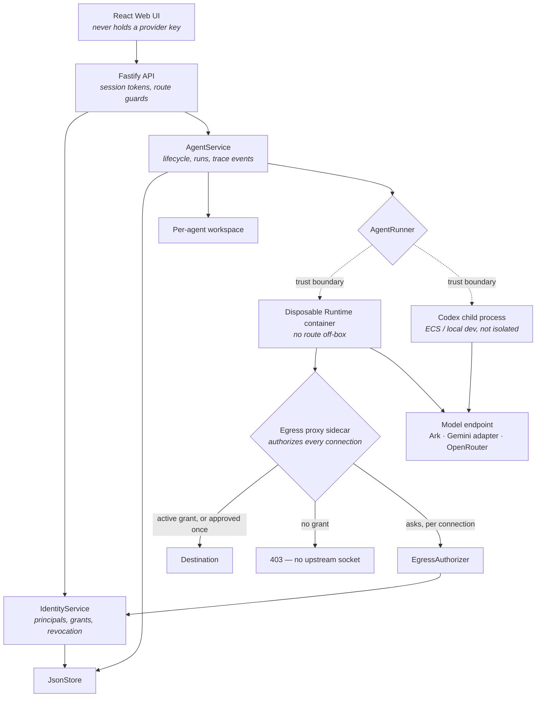

# Architecture

Single-node control plane for hackathon use, plus the Agent Passport middleware
this project adds. The trust boundary is the thing to read for: everything below
the dashed line runs on behalf of a model that is assumed hostile.



Two boundaries do the work, and they are deliberately different:

- **Egress is enforced *before* the side effect.** The agent container has no
  route off-box; the proxy holds each outbound request before opening an
  upstream socket and asks the control plane. A blocked host is unreachable,
  not merely disapproved.
- **Shell-risk classification is *post-execution* telemetry.** Codex reports
  commands as `item.completed`, after they ran. Those `SEC-*` events are audit
  evidence and are never presented as prevention.

## Components

### Web UI

Lists agents, manages lifecycle actions, submits prompts, polls runs, and shows
the Passport panel (grants, live expiry countdowns, one-click revocation) and
the security feed. It never receives a provider key.

### Fastify API

Validates requests and serves the compiled UI. An optional bearer token
protects a remote demo; it is a door lock, not user identity. Operator identity
is separate: `POST /api/mock-principal-session` issues an opaque token held
server-side with an 8h TTL, presented as `x-mock-principal-session`. A client
cannot name a principal it was not issued.

### IdentityService

Human and agent principals, and the grants between them: scoped
(`resource:read`, `resource:write`, `network:egress`), optionally expiring, and
revocable. A delegated grant records the grant it was carved from, so revoking a
parent cascades to its descendants. Authority only flows downhill — an agent
cannot grant itself, nor grant what it does not hold.

### AgentService

Lifecycle state, persistence, workspaces, runs, and the trace timeline. One
agent has at most one active run.

```text
ready -> busy -> ready
  |       |
  v       v
stopped  error
```

Interrupted runs become `cancelled` after a restart.

### EgressAuthorizer and the proxy sidecar

The proxy is dual-attached: to the internal network where the agent lives, and
to an uplink network. The agent is attached only to the internal one. Every
request and CONNECT is authorized against live grants — nothing is cached, so
revocation is felt on the next connection — and if the authorizer cannot be
reached, the proxy denies. Agent identity travels as proxy-auth credentials
derived from a server secret, so a container cannot borrow another agent's
grants by claiming its principal.

### Storage

```text
.data/launchpad.json      Agents, messages, runs, events, principals, grants
workspaces/<agentId>/     Agent-created files
workspaces/.deleted/      Archived deleted workspaces
codex-home/               Codex configuration and sessions
```

`JsonStore` serializes writes and atomically replaces one file. Single-process
only.

### Runtime providers

- `ContainerCodexRunner` — one disposable Docker/Colima/Podman container per
  turn. **The only provider under which egress enforcement exists**, because
  containment is a property of the container topology.
- `CodexRunner` — Codex as a host or in-container process, for ECS and local
  development. Not isolated.

Both use argv-only execution, bound output and time, resume the stored Codex
thread, and escalate termination after a grace period.

### Model providers

Codex speaks the Responses API. Ark and OpenRouter-compatible endpoints are
reached directly. Gemini does not implement `/responses`, so
`gemini-adapter.ts` terminates that protocol locally, downshifts to
`chat/completions`, and re-synthesises a Responses event stream. Provider
selection is `MODEL_PROVIDER`, required when more than one credential is set.

## Deployment profiles

| Profile | Control plane | Agent execution | Egress enforced |
| --- | --- | --- | --- |
| Local POC | Host Node.js | Disposable local container | Yes |
| Local development | Host Node.js | Host Codex process | No |
| ECS | Application container | Codex process in the same container | No |
| Docker Compose | Container | Host-style process (`local-process`) | No |

## Trust boundary

The agent container is the boundary. Ordinary containers are not hardened
multi-tenant isolation, and the workspace mount is writable by design. What the
Passport adds is that the container cannot *reach* anything the operator has not
granted, and that every allow and deny lands on the timeline with a rule ID.

Limits and what is deliberately not solved:
[AGENT-PASSPORT.md](AGENT-PASSPORT.md#honest-limitations).

## Extension seams

Where a team would integrate further middleware. See
[CHALLENGE-BRIEF.md](CHALLENGE-BRIEF.md).

| Direction | Primary seam | Expected change |
| --- | --- | --- |
| Trace and audit | `AgentRunner`, `AgentRun` | Emit and display correlated execution events. |
| Identity and authorization | API routes, `IdentityService` | Extend principals, scopes, or delegation. |
| Threat modeling and safety | `AgentRunner`, `EgressAuthorizer` | Add threat-specific policy or a stronger sandbox. |
| Provider abstraction | `runner-factory`, `gemini-adapter` | Route Codex to another Responses-compatible endpoint. |
