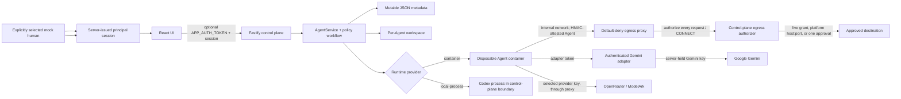

# Implemented architecture and trust boundaries

Volc Agent Launchpad is a single-node control plane for hackathon use, plus
the Agent Passport middleware this project adds. This page separates controls
enforced before a side effect from telemetry observed after one; it describes
the implementation on this branch and does not claim the signed
termination-receipt features from the separate `feature/standout` work.



Two boundaries do the work, and they are deliberately different:

- **Egress is enforced *before* the side effect.** The agent container has no
  route off-box; the proxy holds each outbound request before opening an
  upstream socket and asks the control plane. A blocked host is unreachable,
  not merely disapproved.
- **Shell-risk classification is *post-execution* telemetry.** Codex reports
  commands as `item.completed`, after they ran. Those `SEC-*` events are audit
  evidence and are never presented as prevention.

## Data, identity, and credential flow

The React UI sends lifecycle and approval actions to Fastify and polls Agents,
Runs, approvals, and events. `APP_AUTH_TOKEN` is an optional shared access
secret for a remote demo. It is not a user identity or RBAC system. For action
attribution, the UI explicitly selects a seeded mock human and exchanges that
selection for an opaque, expiring server session. Approval routes reject
caller-supplied `operatorName` and `resolvedBy` fields and derive the resolving
actor only from that session. Because any client holding the shared access
secret can select a seeded mock principal, this remains a demonstrator rather
than production authentication.

Lists agents, manages lifecycle actions, submits prompts, polls runs, and shows
the Passport panel (grants, live expiry countdowns, one-click revocation) and
the security feed. It never receives a provider key.

Each Run stores its initiating human. Each Agent has its own principal. An
approval evidence object correlates the initiating human, executing Agent,
action, resource, decision, result, and resolving actor. Timeouts, cancellation,
request disconnects, restart recovery, and other automatic decisions use fixed
system principal IDs rather than display text supplied by a caller.

`AgentService` stores Agents, sessions, messages, Runs, events, approvals,
principals, and grants in `data/launchpad.json`. `JsonStore` serializes writes
within one process and atomically replaces the file with mode `0600`. Migration
reads approval fields by shape so independently evolved version-5 files remain
compatible. The file is mutable, not append-only or tamper-evident. Deleting an
Agent removes its mutable metadata and timeline and archives its workspace under
`workspaces/.deleted/`. One agent has at most one active run; interrupted runs
become `cancelled` after a restart.

```text
.data/launchpad.json      Agents, messages, runs, events, principals, grants
workspaces/<agentId>/     Agent-created files
workspaces/.deleted/      Archived deleted workspaces
codex-home/               Codex configuration and sessions
```

Validates requests and serves the compiled UI. An optional bearer token
protects a remote demo; it is a door lock, not user identity. Operator identity
is separate: `POST /api/mock-principal-session` issues an opaque token held
server-side with an 8h TTL, presented as `x-mock-principal-session`. A client
cannot name a principal it was not issued.

### IdentityService

Human and agent principals, and the grants between them: scoped
(`resource:read`, `resource:write`, `network:egress`), optionally expiring, and
revocable. A delegated grant records the grant it was carved from, so revoking a
parent cascades to its descendants. Authority only flows downhill — an agent
cannot grant itself, nor grant what it does not hold.

The Runtime never receives the browser access token or the Gemini provider key.
In Gemini mode, it receives a dedicated adapter token and calls the authenticated
`/api/adapter/responses` route; the control plane translates the Responses
protocol and sends the provider key to Google. In OpenRouter and ModelArk modes,
the selected provider key is a Runtime credential because Codex calls that
provider directly. Container-engine commands pass secrets by environment name,
not as `NAME=value` arguments. Treat all Runtime-visible credentials as scoped
demo credentials.

## Enforcement boundaries

### Pre-action network approval

With `RUNTIME_PROVIDER=container` and `EGRESS_ENFORCEMENT=on`, the Agent joins an
internal container network and has no direct external route. Every HTTP request
and CONNECT tunnel reaches the proxy first. The proxy authenticates the Agent,
rejects private/link-local destinations, and asks the control-plane authorizer
before opening an upstream socket. Authorization is request-scoped and checks a
live grant, a port-scoped platform allowance, or a pending `HITL-EGRESS-025`
approval. Denial returns `403` while the destination request counter remains
zero; approval releases that exact held request once.

The approval waiter is registered before the record is persisted, so an
immediate decision or disconnect cannot leave a published approval without an
in-memory owner. Concurrent approvals keep the Agent in `waiting_approval`
until the final one is resolved. An authorizer error, invalid attestation,
provisioning failure, aborted request, timeout, or missing active Run fails
closed.

### EgressAuthorizer and the proxy sidecar

The proxy is dual-attached: to the internal network where the agent lives, and
to an uplink network. The agent is attached only to the internal one. Every
request and CONNECT is authorized against live grants — nothing is cached, so
revocation is felt on the next connection — and if the authorizer cannot be
reached, the proxy denies. Agent identity travels as proxy-auth credentials
derived from a server secret, so a container cannot borrow another agent's
grants by claiming its principal.

### Runtime step approval

`RunnerStepEvent.phase` distinguishes a trusted pre-action callback from an
observation. A Runtime integration that explicitly emits `before` enters the
pause gate. `AgentService` serializes pause, resume, and cancellation; requires
pause to return `true` before publishing the approval; cancels if approval
persistence fails; and cancels if resume is unsupported, throws, or returns
false. The UI says **Runtime Frozen** only for this verified state.

Production Codex emits command and tool details as `item.completed`, which the
parser marks `after`. `evaluateActionRisk` therefore records `SEC-*`
`step.risk_observed` telemetry and does not create a late approval or claim the
command was prevented. An event with no trusted phase is also observational.
For production Codex, filesystem, credential-read, privilege, and package-risk
classification is detective; preventive network safety comes from the proxy.

## Preventive, detective, and recovery controls

| Class | Implemented controls | Boundary and limitation |
| --- | --- | --- |
| Preventive | Request schemas; optional shared bearer access check; opaque mock-principal session; prompt canary check | The session provides trustworthy demo attribution, not production authentication or authorization. Prompt blocking covers the configured literal token. |
| Preventive | Internal container network; per-Agent proxy attestation; private-address denial; live expiring grants; host-and-port platform allowances; one-request HITL release | Active only for container Runtime with egress enforcement on. An established tunnel is not continuously re-authorized. |
| Preventive | Verified pause before approvals from trusted `before` integrations; process/container duration deadline; container CPU, memory, PID, and filesystem limits | Production Codex events are `after`, so its shell-risk classifications do not use this gate. Ordinary containers are not hardened multi-tenant isolation. |
| Preventive / detective | Gemini `maxOutputTokens` request cap; post-run input, output, total-token, duration, and cost accounting | OpenRouter/ModelArk output usage is checked after the Run; cached input is a subset of input and is not added twice. |
| Detective | Completed-step risk events; output/step canary checks; correlated approval evidence; policy and lifecycle timeline | Stored events are mutable and not tamper-evident. Output detection happens after generation. Approvals recorded before server-issued sessions are migrated as `legacy:unverified-operator`: the original name is kept as a display string but is never presented as a verified principal. |
| Recovery | Operator denial; Run cancellation; fail-closed pause/resume handling; approval timeout; egress-strike quarantine; restart reconciliation | Strike counts and principal sessions are in memory. Restart does not resume work. |

- `ContainerCodexRunner` — one disposable Docker/Colima/Podman container per
  turn. **The only provider under which egress enforcement exists**, because
  containment is a property of the container topology.
- `CodexRunner` — Codex as a host or in-container process, for ECS and local
  development. Not isolated.

Both use argv-only execution, bound output and time, resume the stored Codex
thread, and escalate termination after a grace period.

### Model providers

Codex speaks the Responses API. Ark and OpenRouter-compatible endpoints are
reached directly. Gemini does not implement `/responses`, so
`gemini-adapter.ts` terminates that protocol locally, downshifts to
`chat/completions`, and re-synthesises a Responses event stream. Provider
selection is `MODEL_PROVIDER`, required when more than one credential is set.

## Deployment profiles

| Profile | Control plane | Agent execution | Egress enforced |
| --- | --- | --- | --- |
| Local POC | Host Node.js | Disposable local container | Yes |
| Local development | Host Node.js | Host Codex process | No |
| ECS | Application container | Codex process in the same container | No |
| Docker Compose | Container | Host-style process (`local-process`) | No |

## Trust boundary

The agent container is the boundary. Ordinary containers are not hardened
multi-tenant isolation, and the workspace mount is writable by design. What the
Passport adds is that the container cannot *reach* anything the operator has not
granted, and that every allow and deny lands on the timeline with a rule ID.

Limits and what is deliberately not solved:
[AGENT-PASSPORT.md](AGENT-PASSPORT.md#honest-limitations).

## Runtime and network profiles

| Profile | Agent boundary | Network and model behavior |
| --- | --- | --- |
| Local POC container | Disposable Docker, OrbStack, Colima, or Podman container with workspace and `codex-home` bind mounts | With enforcement on, outbound traffic must cross the proxy. Gemini uses the adapter token; OpenRouter/ModelArk use their selected Runtime credential. |
| ECS / Compose `local-process` | Codex process shares the application container | No proxy containment. Use a tightly scoped credential and do not describe this profile as fail-closed network isolation. |
| Host development `local-process` | Codex process runs on the host | No process or network isolation; use only test data and scoped credentials. |

## Where to extend

Where a team would integrate further middleware. See
[CHALLENGE-BRIEF.md](CHALLENGE-BRIEF.md).

| Direction | Primary seam | Expected change |
| --- | --- | --- |
| Trace and audit | `AgentRunner`, `AgentRun` | Emit and display correlated execution events. |
| Identity and authorization | API routes, `IdentityService` | Extend principals, scopes, or delegation. |
| Threat modeling and safety | `AgentRunner`, `EgressAuthorizer` | Add threat-specific policy or a stronger sandbox. |
| Provider abstraction | `runner-factory`, `gemini-adapter` | Route Codex to another Responses-compatible endpoint. |

The proxy and Agent container use fixed, labeled names only after validating
that existing resources match the expected configuration. Agent identity is
bound to signed request material rather than a caller-selected principal
header. The control-plane-to-proxy authorization call uses a separate secret.
Turning `EGRESS_ENFORCEMENT=off` restores ordinary bridge networking.

## Failure behavior

- Unsupported, rejected, or throwing pause cancels the Runtime before an
  approval is published.
- Approval persistence failure after a verified pause cleans the waiter and
  cancels the Runtime.
- Unsupported, rejected, or throwing resume cancels the approved Run and marks
  its result failed.
- A stop/delete race sets cancellation first, serializes the Runtime control,
  denies pending approvals with a system actor, and prevents a second active
  Run.
- Egress denial, authorizer error, invalid Agent attestation, or requester
  disconnect opens no new upstream connection.
- On startup, persisted pending approvals are denied by
  `system:server-restart`; active Runs are cancelled; busy/waiting Agents return
  to ready; and no execution is resumed.
- Provider keys, adapter tokens, and the guardrail canary are redacted from
  messages, approval details, events, errors, and the mutable store.

## Residual risks

- `APP_AUTH_TOKEN` plus mock-principal sessions are a demo identity system, not
  per-user login, RBAC, or non-repudiation.
- JSON history can be edited or deleted and has no signed receipt. Do not claim
  Ed25519 termination receipts unless the separate implementation providing
  them is merged and its proofs are run.
- Production Codex shell/tool events arrive after execution. Only the proxy and
  explicitly trusted `before` integrations provide pre-action gates.
- OpenRouter and ModelArk keys remain visible to their Runtime; Gemini keeps its
  provider key in the control plane but exposes a scoped adapter token.
- Container isolation is not a multi-tenant sandbox. The `local-process`
  profiles provide no network containment.
- Grant revocation affects the next proxy authorization. A connection already
  released by this branch is not continuously re-authorized or drained.
- Platform allowances are host-and-port scoped, not URL-path or request-body
  policy.
- OpenRouter/ModelArk output-token limits are observational after the Run.

## Reproducible evidence

```bash
npm run build --workspace apps/server
node scripts/demo-passport.mjs
node scripts/demo-egress.mjs
npm exec --workspace @launchpad/server -- \
  vitest run src/egress-hitl.integration.test.ts \
             src/container-codex-runner-pause.test.ts \
             src/secret-boundaries.test.ts
```

`demo-passport` prints deny/allow/cross-owner/revocation decisions.
`demo-egress` needs a supported container engine and prints default denial,
grant/revocation, quarantine, proxy-credential rejection, and direct-route
containment observations. The integration tests assert that egress denial
opens zero destination requests, approval opens exactly one, Runtime controls
fail closed, and provider secrets stay out of API responses, events, and the
store.
