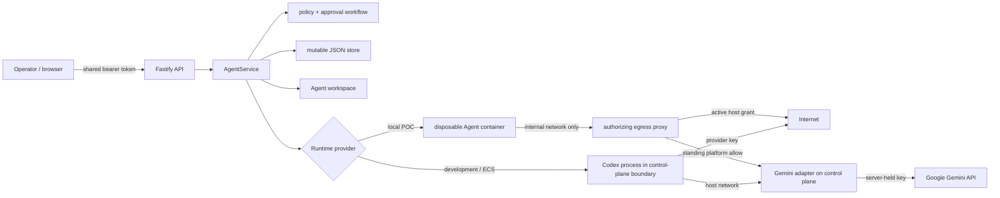

# Implemented architecture and trust boundaries

Volc Agent Launchpad is a single-node hackathon control plane. This page
separates controls enforced at a boundary from signals observed after an action.



## Data and credential flow

The React UI submits lifecycle and approval decisions to Fastify and polls Runs,
approvals, and events. It does not receive a model-provider key. The optional
`APP_AUTH_TOKEN` protects most `/api/*` routes on a remote demo, but it is one
shared bearer secret, not user identity or role-based authorization. Mock human
and Agent principals come from trusted request headers; resource fixtures and
grants demonstrate policy behavior rather than production authentication.

`AgentService` stores Agents, sessions, messages, Runs, events, approvals,
principals, and grants in `data/launchpad.json`. `JsonStore` serializes writes
within one process and atomically replaces the file with mode `0600`. The file
is mutable, not append-only or tamper-evident, and deleting an Agent deletes its
stored Runs, events, and approvals. Workspaces and Codex state live separately
under `workspaces/` and `codex-home/`.

Both Runtime providers receive the configured provider key through environment
variables. In Gemini mode, Codex calls `/api/adapter/responses` on the control
plane; the adapter translates the Responses protocol and sends the key to
Google. The adapter route is exempt from `APP_AUTH_TOKEN`. In OpenRouter mode,
the Runtime calls the configured provider directly. Treat the Runtime as able
to read its model credential, use a scoped demo key, and do not mount unrelated
secrets.

## Execution and approval boundary

`evaluateActionRisk` classifies command, tool, file, and message text into the
`ALLOW-STANDARD-000` and `SEC-*` rules. Codex emits these records as
`item.completed` events. The service therefore evaluates a command only after
Codex reports that item completed, persists an approval, and then requests
`docker pause`/`podman pause` or `SIGSTOP`. Approval can hold later activity,
but it does **not** prove that the reported command was stopped before it ran.
Pause/resume return values are not currently enforced, so this path is a
detective and recovery control, not a fail-closed pre-execution gate.

Approval records and their normal resolutions are persisted. The Promise that
blocks an active execution is in memory. Pending approvals time out as denied
after five minutes; on restart, pending approvals are marked denied, active Runs
are marked cancelled, and busy/waiting Agents return to ready. This recovery
does not resume work across a restart.

## Preventive, detective, and recovery controls

| Class | Implemented controls | Boundary and limitation |
| --- | --- | --- |
| Preventive | Request validation; optional shared bearer token; prompt canary check; container resource limits; internal-network egress proxy | The bearer token is not identity. Prompt blocking covers the configured literal token. Network containment applies only to `RUNTIME_PROVIDER=container` with egress enforcement on. |
| Preventive | Per-connection egress authorization against live, expiring, revocable grants; private-address denial | The proxy denies before opening a request or CONNECT tunnel. Platform hosts are standing-allowed, and revocation affects the next authorization, not an established tunnel. |
| Detective | `evaluateActionRisk`, completed-step events, output canary check, token/cost accounting, trace timeline | Step classification and token budgets run after the corresponding work. Events are mutable and not tamper-evident. |
| Recovery | Pause/resume after a risky completed-step event; operator denial/cancel; duration timeout; egress quarantine; restart reconciliation | Pause is best-effort. Quarantine strike counts are in memory and reset on restart or operator start. |

## Runtime and network trust boundaries

| Profile | Agent boundary | Network behavior |
| --- | --- | --- |
| Local POC | Disposable Docker, Colima, or Podman container with a workspace and `codex-home` bind mount | With enforcement on, the Agent joins an `--internal` network and can leave only through the proxy. |
| ECS / Compose | Codex process in the application container | `local-process` shares the control-plane container and its network; proxy containment is not active. |
| Local development | Codex process on the host | No process or network isolation; use only with test data and scoped credentials. |

The egress proxy asks the control-plane authorizer before each HTTP request or
CONNECT tunnel and denies if the authorizer throws. Provisioning failure stops
the Run before the Agent container starts. `EGRESS_ENFORCEMENT=off` or either
`local-process` profile restores ordinary network access and must not be
described as fail-closed containment.

The enforced container topology has been exercised on Docker/OrbStack. Ordinary
containers are not hardened multi-tenant isolation. The proxy trusts existing
resources with its fixed network/container names, platform allowances are
host-based rather than port/path-based, and an established CONNECT tunnel is
not re-authorized after grant revocation. These are residual risks, alongside
mock header identity, Runtime-visible provider keys, mutable history, and the
post-action approval boundary.

## Reproducible evidence

Build before running either demo:

```bash
npm run build --workspace apps/server
node scripts/demo-passport.mjs
```

The identity demo is the normal and authorization-negative path: it prints a
`403` without a grant, `200` with an own-resource grant, `403` for another
owner's resource, and `403` after revocation, followed by policy events.

The network-negative path needs a running supported container engine:

```bash
node scripts/demo-egress.mjs
```

It prints `403` without an egress grant, `200` after granting `example.com`,
`403` on the next request after revocation, `stopped` after repeated denials,
`403` for a guessed Agent proxy secret, and a blocked direct no-proxy attempt.
The scripts use the real store, API/proxy, and container network, but print
observations rather than assertions; compare every line above. They do not
demonstrate pre-execution command interception or termination of an already
open connection.
