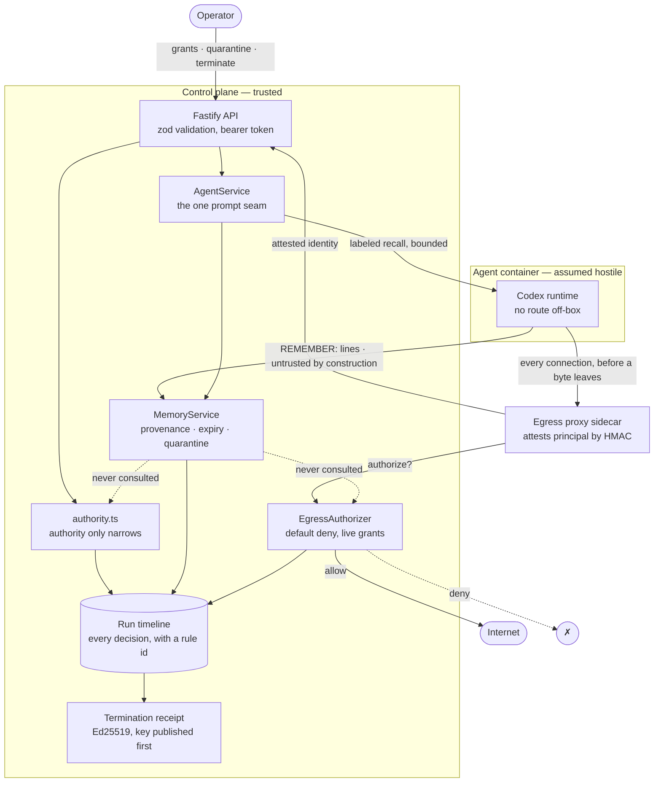

# Agent Passport — architecture and trust boundary

One page. The claim: **an agent's reach, its beliefs, and its authority are
three separate stores, each attenuated at its own boundary, and every decision
across all three lands on one timeline.**

## The three stores

| Store | Answers | Attenuated by | A hijacked agent can… |
|---|---|---|---|
| **Grants** | *What may it reach?* | scope family, target, lifetime — and only ever narrower | …ask for more, and be refused (`AUTHORITY-SELF-ESCALATION-031`) |
| **Memory** | *What does it believe?* | provenance, expiry, quarantine, count and byte bounds | …plant a belief, and watch it arrive labeled and powerless |
| **Runtime** | *What may it run?* | `--internal` network, proxy chokepoint, freeze-before-revoke | …try to leave, and find no route (`NET-EGRESS-020`) |

The dotted lines carry the load-bearing invariant: **memory is never an input
to an authority decision.** A poisoned belief cannot widen a grant or open a
host, which is what stops provenance from being decoration — otherwise an
attacker would simply write the permission it wanted.

## Trust boundary

Everything inside `trusted` decides; everything inside `untrusted` is assumed
compromised. The proxy is the only path between them, and it is a mandatory
chokepoint rather than a configured default: the agent's network has no route
off-box, so identity is a property of the topology, not of a header the agent
could forge. An opaque `CONNECT` tunnel to the control plane is refused
(`NET-EGRESS-TUNNEL-025`) precisely because it could not carry that attestation.

## What the receipt attests

Termination freezes, then closes authority and memory **in one mutation**, tears
down the runtime, and re-probes from the agent's own network position. The
receipt names the grants revoked and the memories quarantined, and is signed
with a key a verifier can fetch *before* termination — so the check does not
depend on trusting this program. `scripts/verify-receipt.mjs` imports none of
it.

## What this does not claim

- Memory trust is derived from **provenance, not content**. We do not detect a
  poisoned belief by reading it; we make sure it cannot escalate or hide.
- The timeline shows a recalled memory and a blocked step in the same run.
  That is **correlation, not proven causation** — we do not claim to know the
  model acted *because of* the belief.
- Operator identity is still a trusted header. Agent identity is attested;
  human identity is not.
- History is mutable JSON. The receipt is tamper-evident; the log it summarises
  is not yet.
